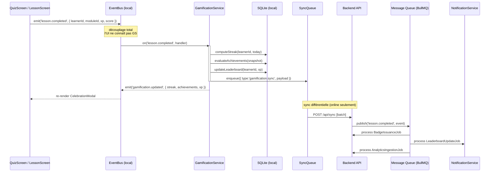
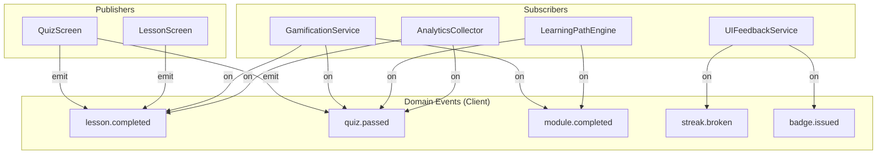
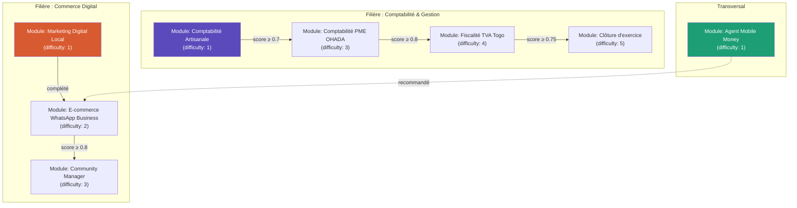
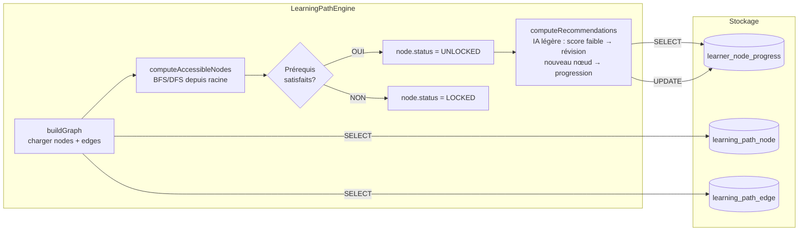
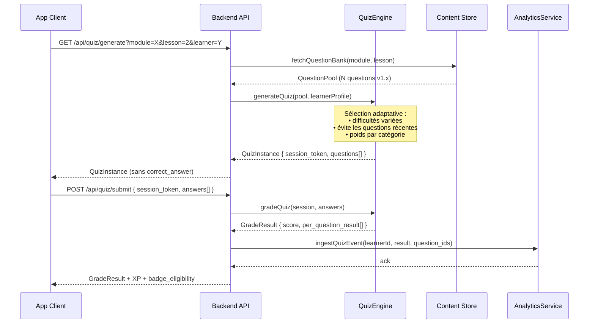
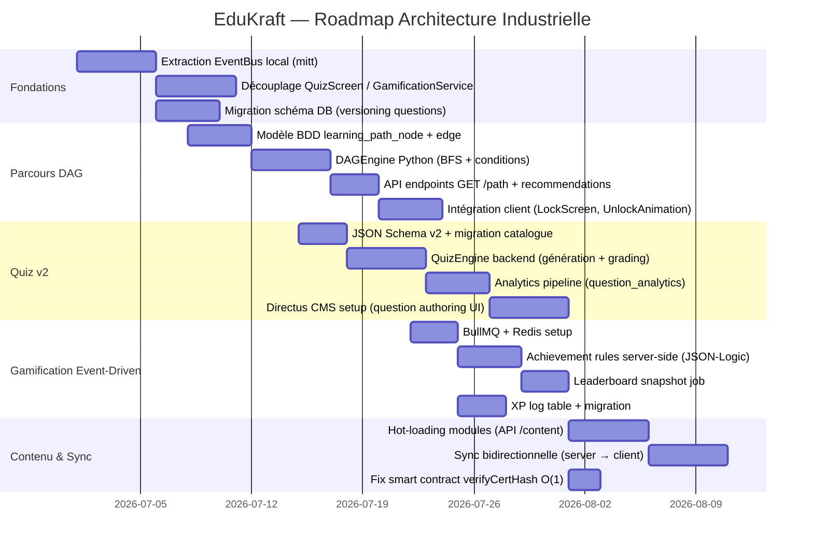

# EduKraft — Architecture Industrielle : Plan de Montée en Gamme

> **Branche d'analyse :** `feat/phase1-functional`
> **Auteur :** Architecte Logiciel Senior (analyse commandée par GeTech)
> **Date :** 2026-06-30
> **Stack actuelle :** React Native (Expo 50) + SQLite (expo-sqlite) + Node.js/Express + SQLite (better-sqlite3) + Polygon ERC-721

---

## 1. Analyse Critique — Points de Friction Actuels

### 1.1 God Object DbProvider (partiellement refactorisé)

Le commit `feat(refactor): Repository pattern` a extrait 5 repositories du `DbProvider.js`, mais le `Context React` reste le seul point d'accès à toute la couche data. Toute l'application consomme `useDb()` comme un monolithe : un seul hook expose learner, XP, sync, badges, quiz, gamification. Ceci crée une dépendance circulaire implicite et empêche les tests unitaires indépendants.

**Risque :** Dès que la base d'apprenants grossit ou que les modules se multiplient, le contexte React re-rend l'ensemble de l'arbre à chaque mutation d'état.

### 1.2 Contenu statique bundlé dans l'APK

Les 8 modules JSON sont importés directement dans `moduleRegistry.js` au build time. Ajouter un module exige une nouvelle release APK. Il n'existe aucun mécanisme de chargement à chaud (hot-loading) ni de versioning de contenu.

**Conséquence :** Impossible de déployer du contenu sans redistribution complète de l'application — cycle de release Google Play/App Store à chaque itération pédagogique.

### 1.3 Logique Gamification Couplée au Cycle de Quiz

Dans `QuizScreen.js`, `recordLessonCompleted` est appelé directement au sein du handler `handleFinish`. La gamification (streak, achievements, XP) est ainsi couplée à la couche UI. Un bug dans la gamification peut faire planter le quiz. Inversement, un refactor de l'UI casse les règles métier.

**Anti-pattern :** Violation du principe SRP (Single Responsibility Principle).

### 1.4 Achievements Définis en Double (Client + Serveur)

`src/gamification/achievements.js` et `server/gamification.js` contiennent deux listes `ACHIEVEMENT_DEFS` maintenues manuellement en parallèle. Toute nouvelle règle doit être dupliquée à la main.

**Risque :** Désynchronisation silencieuse entre client et serveur — un achievement peut s'afficher côté app sans jamais être persisté en base.

### 1.5 Pas de DAG pour les Parcours — Navigation Linéaire Pure

Le schéma actuel est : `module → lessons[index] → quiz`. Les prérequis (`prerequisites: []` dans le JSON) sont déclarés mais jamais exploités. Il n'existe aucun moteur de graphe pour calculer les nœuds accessibles, les dépendances entre modules, ni pour adapter le parcours à la performance de l'apprenant.

### 1.6 Quiz : Type Unique et Sans Versioning

Le seul type de question supporté est `single_choice`. Il n'y a pas de `question_version`, pas de `content_hash`, pas de mécanisme de rollback. Un changement de question invalide rétroactivement tous les historiques de tentatives liés à l'ancienne version.

### 1.7 Sync Optimiste Mono-Directionnelle

Le `syncEngine.js` pousse une `sync_queue` du client vers le serveur, mais il n'existe pas de flux descendant (server → client) pour distribuer des mises à jour de contenu, des corrections de module ou des règles d'achievement modifiées.

### 1.8 Smart Contract — `verifyCertHash` O(n) Linéaire

La fonction `verifyCertHash` dans `EduKraftBadge.sol` itère sur tous les tokens pour retrouver un hash. À l'échelle (10 000+ badges), cette boucle consomme tout le gas disponible et rend la vérification inopérante.

---

## 2. Architecture Cible — Vue d'Ensemble

```
┌─────────────────────────────────────────────────────────────────────────┐
│                        CLIENT (React Native / Expo)                      │
│                                                                          │
│  ┌──────────┐  ┌──────────┐  ┌─────────────┐  ┌─────────────────────┐  │
│  │  Quiz    │  │ Lesson   │  │  Dashboard  │  │  BadgeWallet        │  │
│  │  Screen  │  │ Screen   │  │  Screen     │  │  Screen             │  │
│  └─────┬────┘  └────┬─────┘  └──────┬──────┘  └──────────┬──────────┘  │
│        │             │               │                      │             │
│        └─────────────┴───────────────┴──────────────────────┘            │
│                              │ Domain Events                              │
│                    ┌─────────▼──────────┐                                │
│                    │  EventBus (local)  │                                │
│                    │  mitt / EventEmitter│                                │
│                    └──┬────────┬────────┘                                │
│              ┌────────┘        └────────┐                                │
│    ┌─────────▼────────┐   ┌────────────▼──────────┐                     │
│    │ GamificationService│  │  LearningPathEngine   │                     │
│    │ (Subscriber)      │  │  (DAG Navigator)      │                     │
│    └─────────┬─────────┘  └───────────────────────┘                     │
│              │                                                            │
│    ┌─────────▼─────────────────────────────────────┐                    │
│    │              Repository Layer                  │                    │
│    │  Learner │ Progress │ Quiz │ Badge │ Gamif     │                    │
│    └─────────────────────┬─────────────────────────┘                    │
│                          │ SQLite (expo-sqlite WAL)                      │
│                    ┌─────▼──────┐                                        │
│                    │ SyncEngine │ ←── offline-first queue                │
│                    └─────┬──────┘                                        │
└──────────────────────────┼──────────────────────────────────────────────┘
                           │ HTTPS (REST + WebSocket)
┌──────────────────────────┼──────────────────────────────────────────────┐
│                    BACKEND (Node.js / Python FastAPI)                    │
│                                                                          │
│  ┌────────────┐  ┌───────────────┐  ┌──────────────┐  ┌─────────────┐  │
│  │  Auth      │  │ Content CMS   │  │ Gamification │  │  Analytics  │  │
│  │  Service   │  │ (Headless)    │  │  Engine      │  │  Service    │  │
│  └────────────┘  └───────────────┘  └──────────────┘  └─────────────┘  │
│                                                                          │
│           ┌────────────────────────────────────────┐                    │
│           │         Message Queue (Redis/BullMQ)   │                    │
│           │  lesson.completed │ badge.issued │ ...  │                    │
│           └─────────────────────────────────────────┘                   │
│                                                                          │
│  ┌──────────────────────────────────────────────────────────────────┐   │
│  │  PostgreSQL (primary) + Redis (cache/events) + TimescaleDB       │   │
│  │  (analytics time-series)                                         │   │
│  └──────────────────────────────────────────────────────────────────┘   │
└─────────────────────────────────────────────────────────────────────────┘
                           │
        ┌──────────────────┼──────────────────────┐
        │                  │                       │
  ┌─────▼──────┐   ┌───────▼─────┐      ┌────────▼────────┐
  │ Polygon    │   │ Strapi/     │      │  Metabase /     │
  │ ERC-721    │   │ Directus    │      │  Grafana        │
  │ (Badges)   │   │ (Content)   │      │  (Analytics)    │
  └────────────┘   └─────────────┘      └─────────────────┘
```

---

## 3. Pilier 1 — Gamification : Système Événementiel Découplé

### 3.1 Diagramme de Flux — Event-Driven Gamification



### 3.2 Architecture EventBus Local (Client)



### 3.3 Schéma de Base de Données — Module Gamification

```sql
-- ── Règles d'achievement versionnées (côté serveur) ──────────────────────
CREATE TABLE achievement_rule (
    id              UUID PRIMARY KEY DEFAULT gen_random_uuid(),
    key             TEXT NOT NULL UNIQUE,       -- 'streak_7', 'perfect_quiz'
    category        TEXT NOT NULL,              -- 'consistency' | 'mastery' | ...
    title           TEXT NOT NULL,
    description     TEXT NOT NULL,
    version         INTEGER NOT NULL DEFAULT 1,
    evaluate_fn     JSONB NOT NULL,             -- AST de la règle sérialisée
    -- ex: {"op":"gte","field":"bestStreak","value":7}
    xp_reward       INTEGER DEFAULT 0,
    icon            TEXT,
    is_active       BOOLEAN DEFAULT TRUE,
    created_at      TIMESTAMPTZ DEFAULT now(),
    updated_at      TIMESTAMPTZ DEFAULT now()
);

-- ── XP et niveaux ────────────────────────────────────────────────────────
CREATE TABLE learner_xp_log (
    id              UUID PRIMARY KEY DEFAULT gen_random_uuid(),
    learner_id      UUID NOT NULL REFERENCES learner(id) ON DELETE CASCADE,
    source          TEXT NOT NULL,              -- 'quiz' | 'streak' | 'bonus'
    source_ref_id   UUID,                       -- quiz_attempt_id ou autre
    xp_delta        INTEGER NOT NULL,           -- positif ou négatif
    xp_after        INTEGER NOT NULL,           -- solde cumulé après
    occurred_at     TIMESTAMPTZ DEFAULT now()
);
CREATE INDEX idx_xp_log_learner_time ON learner_xp_log(learner_id, occurred_at DESC);

-- ── Classements (Leaderboard) ────────────────────────────────────────────
-- Matérialisé périodiquement via job BullMQ pour éviter les agrégations live
CREATE TABLE leaderboard_snapshot (
    id              UUID PRIMARY KEY DEFAULT gen_random_uuid(),
    scope           TEXT NOT NULL,              -- 'global' | 'filiere:{id}' | 'weekly'
    learner_id      UUID NOT NULL REFERENCES learner(id),
    rank            INTEGER NOT NULL,
    total_xp        INTEGER NOT NULL,
    computed_at     TIMESTAMPTZ DEFAULT now(),
    UNIQUE(scope, learner_id)
);
CREATE INDEX idx_leaderboard_scope_rank ON leaderboard_snapshot(scope, rank);
```

### 3.4 Design Patterns & Stack Recommandés

| Besoin | Pattern | Outil |
|---|---|---|
| Découplage UI/Gamification | Observer / EventEmitter | `mitt` (2KB, zéro dépendance) |
| Règles d'achievement évolutives | Strategy Pattern | JSON-Logic ou règles AST côté serveur |
| Traitement async des events | Job Queue | `BullMQ` + Redis (backend) |
| Calcul de classement | Snapshot Pattern | Cron job matérialisant la vue |
| Cache de score | Read-through Cache | Redis `ZADD` (sorted set natif) |

---

## 4. Pilier 2 — Parcours d'Apprentissage : Graphe Acyclique Orienté (DAG)

### 4.1 Diagramme — Modèle DAG des Parcours



### 4.2 Diagramme — Moteur de Navigation DAG



### 4.3 Schéma de Base de Données — Module Parcours

```sql
-- ── Nœuds du graphe (modules, leçons, évaluations) ───────────────────────
CREATE TABLE learning_path_node (
    id              UUID PRIMARY KEY DEFAULT gen_random_uuid(),
    node_type       TEXT NOT NULL,             -- 'module' | 'lesson' | 'assessment'
    ref_id          TEXT NOT NULL,             -- module_id ou lesson_id métier
    title           TEXT NOT NULL,
    filiere         TEXT,
    difficulty      SMALLINT DEFAULT 1,        -- 1-5
    estimated_min   INTEGER,
    xp_value        INTEGER DEFAULT 0,
    is_active       BOOLEAN DEFAULT TRUE,
    metadata        JSONB DEFAULT '{}'::JSONB,  -- données étendues libres
    created_at      TIMESTAMPTZ DEFAULT now()
);

-- ── Arêtes du DAG (dépendances entre nœuds) ──────────────────────────────
CREATE TABLE learning_path_edge (
    id              UUID PRIMARY KEY DEFAULT gen_random_uuid(),
    from_node_id    UUID NOT NULL REFERENCES learning_path_node(id) ON DELETE CASCADE,
    to_node_id      UUID NOT NULL REFERENCES learning_path_node(id) ON DELETE CASCADE,
    condition_type  TEXT NOT NULL DEFAULT 'completion',
    -- 'completion' | 'min_score' | 'min_xp' | 'manual'
    condition_value JSONB DEFAULT '{}'::JSONB,
    -- ex: {"min_score": 0.75} ou {"min_xp": 200}
    edge_type       TEXT DEFAULT 'prerequisite',
    -- 'prerequisite' | 'recommended' | 'optional'
    weight          REAL DEFAULT 1.0,           -- pour algorithmes de scoring
    UNIQUE(from_node_id, to_node_id),
    CHECK (from_node_id <> to_node_id)         -- pas d'auto-boucle
);

-- ── Progression de l'apprenant par nœud ──────────────────────────────────
CREATE TABLE learner_node_progress (
    id              UUID PRIMARY KEY DEFAULT gen_random_uuid(),
    learner_id      UUID NOT NULL REFERENCES learner(id) ON DELETE CASCADE,
    node_id         UUID NOT NULL REFERENCES learning_path_node(id),
    status          TEXT NOT NULL DEFAULT 'locked',
    -- 'locked' | 'unlocked' | 'in_progress' | 'completed' | 'mastered'
    best_score      REAL,                       -- 0.0–1.0
    attempts        INTEGER DEFAULT 0,
    xp_earned       INTEGER DEFAULT 0,
    unlocked_at     TIMESTAMPTZ,
    started_at      TIMESTAMPTZ,
    completed_at    TIMESTAMPTZ,
    last_attempt_at TIMESTAMPTZ,
    adaptive_hints  JSONB DEFAULT '[]'::JSONB,  -- hints IA générés
    UNIQUE(learner_id, node_id)
);
CREATE INDEX idx_node_progress_learner ON learner_node_progress(learner_id, status);

-- ── Chemins personnalisés (parcours recommandés par l'IA) ─────────────────
CREATE TABLE adaptive_path (
    id              UUID PRIMARY KEY DEFAULT gen_random_uuid(),
    learner_id      UUID NOT NULL REFERENCES learner(id),
    generated_at    TIMESTAMPTZ DEFAULT now(),
    algorithm       TEXT NOT NULL,              -- 'linear' | 'spaced_repetition' | 'ai_v1'
    node_sequence   JSONB NOT NULL,             -- [{node_id, priority, reason}]
    is_active       BOOLEAN DEFAULT TRUE,
    expires_at      TIMESTAMPTZ
);
```

### 4.4 Algorithme de Navigation DAG (Python)

```python
# learning_path/dag_engine.py
from dataclasses import dataclass, field
from typing import Optional
from collections import defaultdict, deque
import json

@dataclass
class NodeProgress:
    node_id: str
    status: str  # locked | unlocked | completed
    best_score: float = 0.0
    xp_earned: int = 0

@dataclass
class Edge:
    from_node: str
    to_node: str
    condition_type: str  # completion | min_score | min_xp
    condition_value: dict = field(default_factory=dict)
    edge_type: str = "prerequisite"

class DAGEngine:
    """
    Moteur de navigation sur le graphe de parcours.
    Pattern: Strategy pour les conditions + BFS pour la traversée.
    """

    def __init__(self, nodes: list[dict], edges: list[Edge]):
        self.nodes = {n["id"]: n for n in nodes}
        self.edges = edges
        # Index : quels nœuds sont accessibles depuis chaque nœud ?
        self._adj: dict[str, list[Edge]] = defaultdict(list)
        # Index inverse : quels prérequis un nœud a-t-il ?
        self._prereqs: dict[str, list[Edge]] = defaultdict(list)
        for e in edges:
            if e.edge_type == "prerequisite":
                self._adj[e.from_node].append(e)
                self._prereqs[e.to_node].append(e)

    def _satisfies_condition(self, edge: Edge, progress: NodeProgress) -> bool:
        """Strategy pattern : évalue la condition d'une arête."""
        if edge.condition_type == "completion":
            return progress.status == "completed"
        if edge.condition_type == "min_score":
            return (progress.best_score or 0.0) >= edge.condition_value.get("min_score", 0.0)
        if edge.condition_type == "min_xp":
            return (progress.xp_earned or 0) >= edge.condition_value.get("min_xp", 0)
        return False  # condition inconnue = bloqué par défaut

    def compute_accessible_nodes(
        self,
        all_progress: dict[str, NodeProgress],
        root_node_ids: Optional[list[str]] = None,
    ) -> dict[str, str]:  # node_id → new_status
        """
        BFS depuis les racines (nœuds sans prérequis ou racines explicites).
        Retourne les statuts mis à jour pour chaque nœud.
        """
        # Nœuds racines = pas de prérequis entrants
        if root_node_ids is None:
            root_node_ids = [
                nid for nid in self.nodes
                if not self._prereqs[nid]
            ]

        updated: dict[str, str] = {}
        queue = deque(root_node_ids)
        visited = set()

        while queue:
            node_id = queue.popleft()
            if node_id in visited:
                continue
            visited.add(node_id)

            prog = all_progress.get(node_id, NodeProgress(node_id, "locked"))

            # Vérifier si tous les prérequis entrants sont satisfaits
            prereq_edges = self._prereqs[node_id]
            if prereq_edges:
                all_satisfied = all(
                    self._satisfies_condition(e, all_progress.get(e.from_node, NodeProgress(e.from_node, "locked")))
                    for e in prereq_edges
                )
                if not all_satisfied:
                    updated[node_id] = "locked"
                    continue

            # Ce nœud est accessible
            if prog.status == "locked":
                updated[node_id] = "unlocked"
            else:
                updated[node_id] = prog.status

            # Propager aux nœuds suivants
            for edge in self._adj[node_id]:
                queue.append(edge.to_node)

        return updated

    def compute_recommendations(
        self,
        all_progress: dict[str, NodeProgress],
        max_recommendations: int = 3,
    ) -> list[dict]:
        """
        Recommandations adaptatives simples :
        1. Modules débloqués non commencés (priorité haute)
        2. Modules en cours (reprendre)
        3. Modules complétés avec score < 0.8 (révision)
        """
        accessible = self.compute_accessible_nodes(all_progress)
        recommendations = []

        for node_id, status in accessible.items():
            prog = all_progress.get(node_id, NodeProgress(node_id, "locked"))
            node = self.nodes[node_id]

            if status == "unlocked":
                recommendations.append({
                    "node_id": node_id,
                    "title": node["title"],
                    "reason": "new",
                    "priority": 1,
                })
            elif status == "in_progress":
                recommendations.append({
                    "node_id": node_id,
                    "title": node["title"],
                    "reason": "continue",
                    "priority": 2,
                })
            elif status == "completed" and (prog.best_score or 0) < 0.8:
                recommendations.append({
                    "node_id": node_id,
                    "title": node["title"],
                    "reason": "review",
                    "priority": 3,
                })

        return sorted(recommendations, key=lambda r: r["priority"])[:max_recommendations]
```

---

## 5. Pilier 3 — Quiz Dynamiques : Structure Robuste & Versioning

### 5.1 Diagramme — Flux de Données Quiz



### 5.2 Schéma de Base de Données — Module Quiz

```sql
-- ── Catalogue de questions (avec versioning) ──────────────────────────────
CREATE TABLE question (
    id              UUID PRIMARY KEY DEFAULT gen_random_uuid(),
    question_key    TEXT NOT NULL,              -- identifiant stable ex: 'ohada_q0_0'
    version         INTEGER NOT NULL DEFAULT 1,
    is_current      BOOLEAN NOT NULL DEFAULT TRUE,

    -- Contenu
    module_ref      TEXT NOT NULL,             -- module_id métier
    lesson_index    INTEGER,
    question_type   TEXT NOT NULL,
    -- 'single_choice' | 'multi_choice' | 'true_false' | 'fill_blank' | 'ordering'
    text            TEXT NOT NULL,
    rich_content    JSONB DEFAULT '{}'::JSONB, -- images, formules LaTeX, code
    options         JSONB NOT NULL,
    -- [{id, text, is_correct, explanation}]
    correct_answer  JSONB NOT NULL,            -- séparé pour ne pas envoyer au client
    explanation     TEXT,
    hint            TEXT,

    -- Classification
    difficulty      SMALLINT DEFAULT 2,        -- 1 (facile) à 5 (expert)
    bloom_level     TEXT,
    -- 'remember' | 'understand' | 'apply' | 'analyze'
    tags            TEXT[] DEFAULT '{}',
    language        TEXT DEFAULT 'fr',

    -- Métriques calculées (mis à jour par analytics job)
    avg_score       REAL,                      -- taux de réussite global
    avg_time_sec    REAL,                      -- temps moyen de réponse
    discrimination  REAL,                      -- indice de discrimination IRT
    attempt_count   INTEGER DEFAULT 0,

    -- Traçabilité
    authored_by     TEXT,
    content_hash    TEXT NOT NULL,             -- SHA-256 du contenu pour déduplication
    deprecated_at   TIMESTAMPTZ,
    created_at      TIMESTAMPTZ DEFAULT now(),
    updated_at      TIMESTAMPTZ DEFAULT now(),

    UNIQUE(question_key, version)
);
CREATE INDEX idx_question_module ON question(module_ref, lesson_index, is_current);
CREATE INDEX idx_question_difficulty ON question(difficulty, is_current);
CREATE INDEX idx_question_content_hash ON question(content_hash);

-- ── Sessions de quiz (instances générées) ────────────────────────────────
CREATE TABLE quiz_session (
    id              UUID PRIMARY KEY DEFAULT gen_random_uuid(),
    session_token   TEXT NOT NULL UNIQUE DEFAULT gen_random_uuid()::TEXT,
    learner_id      UUID NOT NULL REFERENCES learner(id),
    module_ref      TEXT NOT NULL,
    lesson_index    INTEGER,
    question_ids    UUID[] NOT NULL,           -- liste ordonnée des questions
    generation_algo TEXT DEFAULT 'random',     -- algo de sélection utilisé
    passing_score   REAL NOT NULL DEFAULT 0.67,
    xp_reward       INTEGER DEFAULT 0,
    xp_bonus_perfect INTEGER DEFAULT 0,
    status          TEXT DEFAULT 'pending',    -- 'pending' | 'submitted' | 'graded'
    expires_at      TIMESTAMPTZ,               -- TTL pour anti-triche
    created_at      TIMESTAMPTZ DEFAULT now()
);

-- ── Tentatives de quiz (résultats détaillés) ─────────────────────────────
CREATE TABLE quiz_attempt (
    id              UUID PRIMARY KEY DEFAULT gen_random_uuid(),
    session_id      UUID NOT NULL REFERENCES quiz_session(id),
    learner_id      UUID NOT NULL REFERENCES learner(id),
    module_ref      TEXT NOT NULL,
    lesson_index    INTEGER,
    attempt_number  INTEGER DEFAULT 1,

    -- Résultats agrégés
    score           REAL NOT NULL,
    passed          BOOLEAN NOT NULL DEFAULT FALSE,
    is_perfect      BOOLEAN NOT NULL DEFAULT FALSE,
    xp_awarded      INTEGER DEFAULT 0,
    duration_sec    INTEGER,

    -- Résultats détaillés par question
    answers         JSONB NOT NULL,
    -- [{question_id, question_version, selected, is_correct, time_sec}]

    submitted_at    TIMESTAMPTZ DEFAULT now(),

    -- Sync offline
    client_id       TEXT,
    sync_status     TEXT DEFAULT 'pending'
);
CREATE INDEX idx_attempt_learner ON quiz_attempt(learner_id, submitted_at DESC);
CREATE INDEX idx_attempt_module ON quiz_attempt(module_ref, lesson_index);

-- ── Analytics questions (mis à jour par job asynchrone) ──────────────────
CREATE TABLE question_analytics (
    question_id     UUID NOT NULL REFERENCES question(id),
    question_version INTEGER NOT NULL,
    period_date     DATE NOT NULL,             -- agrégat journalier
    attempt_count   INTEGER DEFAULT 0,
    correct_count   INTEGER DEFAULT 0,
    avg_time_sec    REAL,
    option_distribution JSONB DEFAULT '{}'::JSONB,
    -- {"a": 0.4, "b": 0.1, "c": 0.5}
    PRIMARY KEY(question_id, question_version, period_date)
);
```

### 5.3 JSON Schema des Questions (v2)

```json
{
  "$schema": "https://json-schema.org/draft/2020-12/schema",
  "$id": "https://schema.edukraft.tg/question/v2.json",
  "title": "EduKraft Question v2",
  "type": "object",
  "required": ["id", "version", "question_type", "text", "options", "difficulty"],
  "properties": {
    "id":            { "type": "string", "format": "uuid" },
    "question_key":  { "type": "string", "pattern": "^[a-z0-9_]+$" },
    "version":       { "type": "integer", "minimum": 1 },
    "question_type": {
      "type": "string",
      "enum": ["single_choice", "multi_choice", "true_false", "fill_blank", "ordering"]
    },
    "text":          { "type": "string", "minLength": 10 },
    "rich_content":  {
      "type": "object",
      "properties": {
        "image_url":  { "type": "string", "format": "uri" },
        "latex":      { "type": "string" },
        "code":       { "type": "string" }
      }
    },
    "options": {
      "type": "array",
      "minItems": 2,
      "maxItems": 6,
      "items": {
        "type": "object",
        "required": ["id", "text"],
        "properties": {
          "id":          { "type": "string" },
          "text":        { "type": "string" },
          "explanation": { "type": "string" }
        }
      }
    },
    "difficulty":    { "type": "integer", "minimum": 1, "maximum": 5 },
    "bloom_level":   {
      "type": "string",
      "enum": ["remember", "understand", "apply", "analyze", "evaluate", "create"]
    },
    "tags":          { "type": "array", "items": { "type": "string" } },
    "language":      { "type": "string", "default": "fr" },
    "content_hash":  { "type": "string", "pattern": "^[a-f0-9]{64}$" }
  }
}
```

### 5.4 Design Patterns & Stack Recommandés

| Besoin | Pattern | Outil |
|---|---|---|
| Versioning questions | Event Sourcing léger | `question_key` + `version` + `is_current` flag |
| Sélection adaptative | Strategy Pattern | Algo de sélection pluggable (random, IRT, spaced-repetition) |
| CMS de contenu | Headless CMS | Directus (self-hosted, API REST + JSONB natif) |
| Validation schéma | Schema Validation | `ajv` (Node.js) / `jsonschema` (Python) |
| Analytics temps-réel | CQRS read-side | Vue matérialisée PostgreSQL ou TimescaleDB |
| Anti-triche session | Token TTL | `quiz_session.expires_at` + vérification serveur |

---

## 6. Correction Smart Contract — `verifyCertHash` O(1)

Le contrat actuel boucle sur tous les tokens pour vérifier un hash (O(n)). Correctif :

```solidity
// Ajouter dans EduKraftBadge.sol :

// Index inverse : certHash → tokenId (O(1) lookup)
mapping(bytes32 => uint256) private _certHashToTokenId;

// Dans mintBadge(), après le mint :
bytes32 hashKey = keccak256(bytes(certHash));
require(_certHashToTokenId[hashKey] == 0, "CertHash already exists");
_certHashToTokenId[hashKey] = tokenId;

// Remplacer verifyCertHash() :
function verifyCertHash(string calldata certHash) external view returns (uint256) {
    bytes32 hashKey = keccak256(bytes(certHash));
    return _certHashToTokenId[hashKey]; // 0 si non trouvé
}
```

---

## 7. Roadmap d'Implémentation (8 Semaines)



---

## 8. Résumé des Recommandations

| Domaine | État Actuel | Cible Industrielle |
|---|---|---|
| **Gamification** | Couplée à QuizScreen, dupliquée client/serveur | EventBus (mitt) + Achievement Rules serveur (JSON-Logic) + BullMQ |
| **Parcours** | Navigation linéaire index++, prérequis ignorés | DAG PostgreSQL + DAGEngine Python + API adaptive path |
| **Quiz** | Type unique, sans versioning, sans analytics | JSON Schema v2 + versioning + Directus CMS + TimescaleDB analytics |
| **Contenu** | Bundlé APK (8 JSON statiques) | Hot-loading via API /content + sync bidirectionnelle |
| **Smart Contract** | verifyCertHash O(n) | Mapping inverse bytes32 → tokenId (O(1)) |
| **Achievements** | Dupliqués JS client + JS serveur | Source unique de vérité JSON serveur, évalués par règle sérialisée |
| **Analytics** | Absents | question_analytics + leaderboard_snapshot + Grafana/Metabase |
